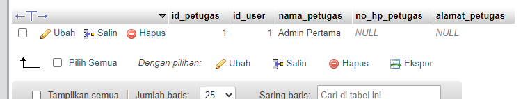

# AUTHENTICATION
```bash
$conn = mysqli_connect('localhost', 'root', '', 'ukk_spp');
$password = password_hash('admin', PASSWORD_DEFAULT);
mysqli_query($conn, "INSERT INTO users(username, password, level) VALUES('admin', '$password', 1)");
mysqli_query($conn, "INSERT INTO petugas(id_user, nama_petugas) VALUES(1, 'Admin Pertama')");
```


